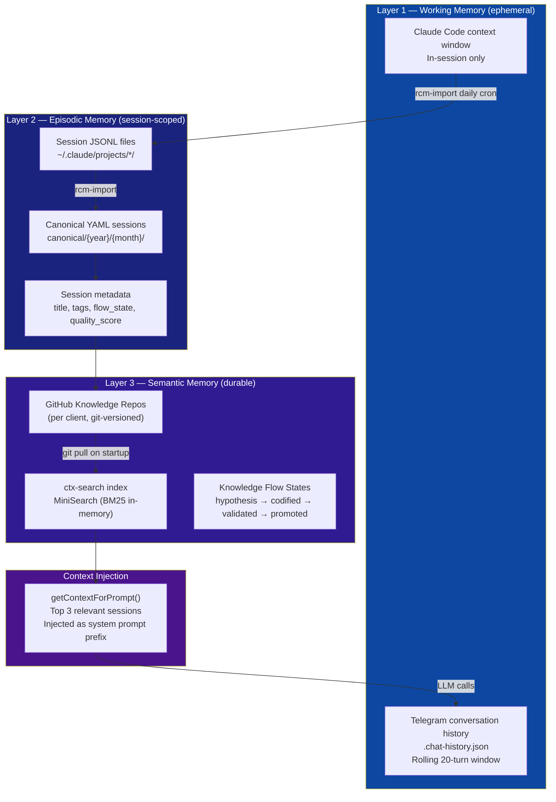
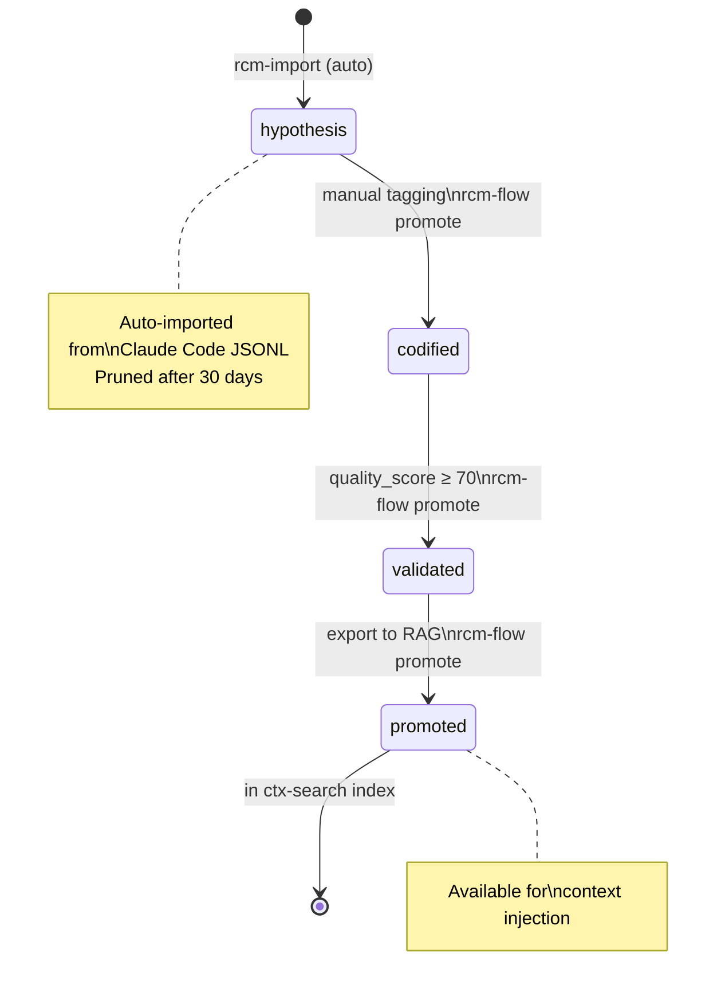
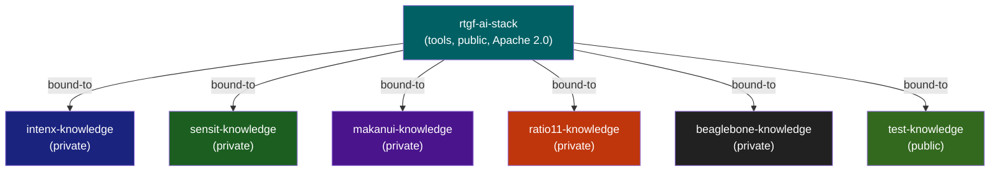

# Memory Model

The AI Stack implements a tri-layer memory architecture spanning ephemeral working memory, structured episodic memory, and durable semantic knowledge.

## Memory Architecture



## Knowledge Flow States

Sessions progress through a validation pipeline before reaching the RAG index:



## Memory Taxonomy

| Type | Layer | Store | Lifetime | Access |
|------|-------|-------|----------|--------|
| **Working** | L1 | `.chat-history.json` | Session / rolling 20 turns | Telegram bot |
| **Episodic** | L2 | YAML + git | Permanent (per session) | rcm-import, rcm-find-orphans |
| **Semantic** | L3 | GitHub repos + MiniSearch | Permanent + searchable | ctx-search |
| **Procedural** | L3 | CLAUDE.md + AGENTS.md | Permanent | Claude Code context |

## Repository Topology



Each knowledge repo structure:
```
{client}-knowledge/
├── ctx/
│   ├── archive/
│   │   ├── raw/{platform}/          # Original JSONL (gitignored)
│   │   └── canonical/{year}/{month}/ # Unified YAML
│   ├── flows/
│   │   ├── hypothesis/              # Auto-imported, unreviewed
│   │   ├── codified/                # Tagged, structured
│   │   ├── validated/               # Quality-checked
│   │   └── promoted/                # RAG-indexed
│   └── schemas/
└── README.md
```

## Git Growth Management

!!! warning "Raw session data grows fast"
    `ctx/archive/raw/` JSONL files should be in `.gitignore` in all knowledge repos. Only canonical YAML and flow-state sessions belong in git.

**Mitigation strategy:**

- `raw/` never committed (gitignored)
- `hypothesis/` auto-pruned after 30 days (cron job — **pending**)
- Long-term: git stores manifests only; raw content migrates to S3/cold storage
