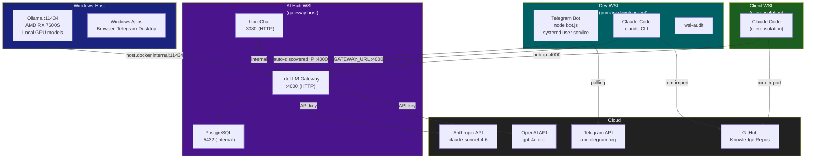
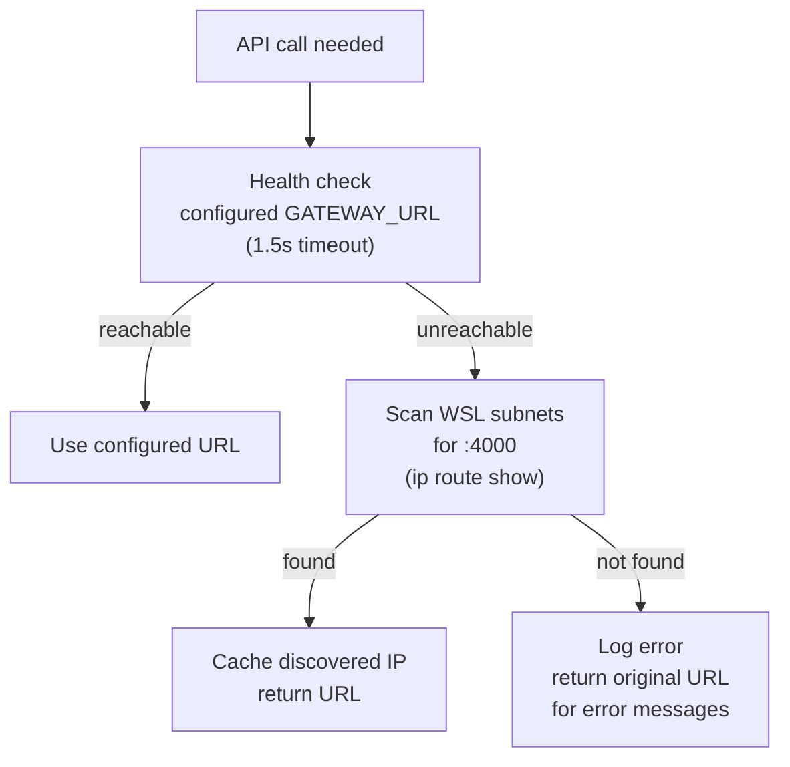
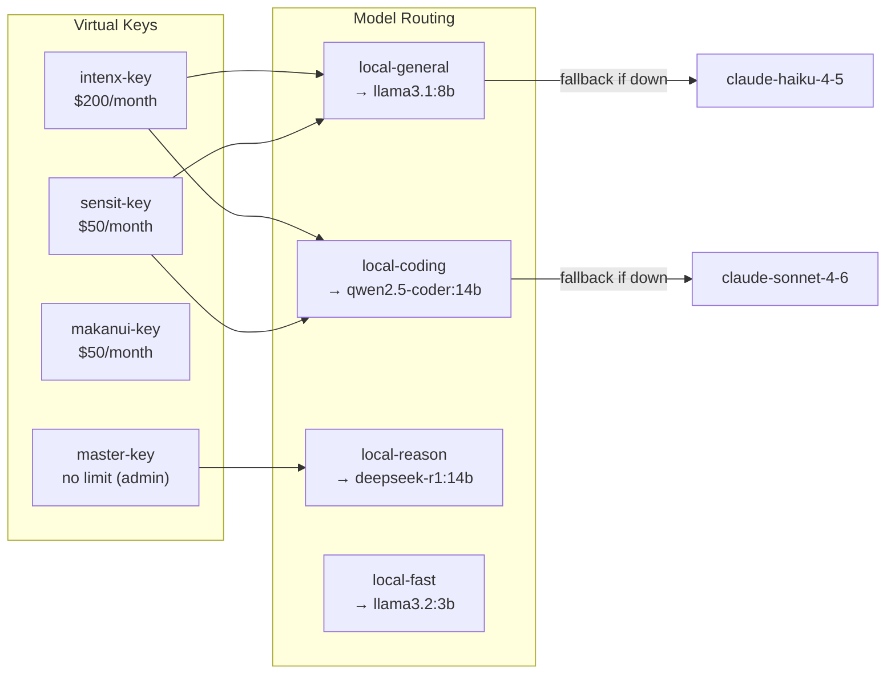

# Network Topology

## Service Map

## Port Reference

| Service | Host | Port | Protocol | Notes |
|---------|------|------|----------|-------|
| Ollama API | Windows | 11434 | HTTP | Accessible from all WSL via NAT bridge |
| LiteLLM Gateway | AI Hub WSL | 4000 | HTTP | OpenAI-compatible `/v1` endpoint |
| LiteLLM UI | AI Hub WSL | 4000 | HTTP | `/ui` dashboard |
| LibreChat | AI Hub WSL | 3080 | HTTP | Web UI |
| PostgreSQL | AI Hub WSL | 5432 | TCP | Internal, LiteLLM backend only |

## Gateway Discovery

WSL2 subnet IPs change on Windows reboot. The Telegram bot uses auto-discovery:

## Client Isolation

Each client context has its own LiteLLM virtual key with independent budget:

