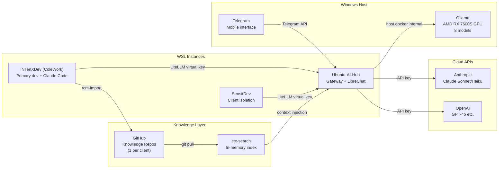
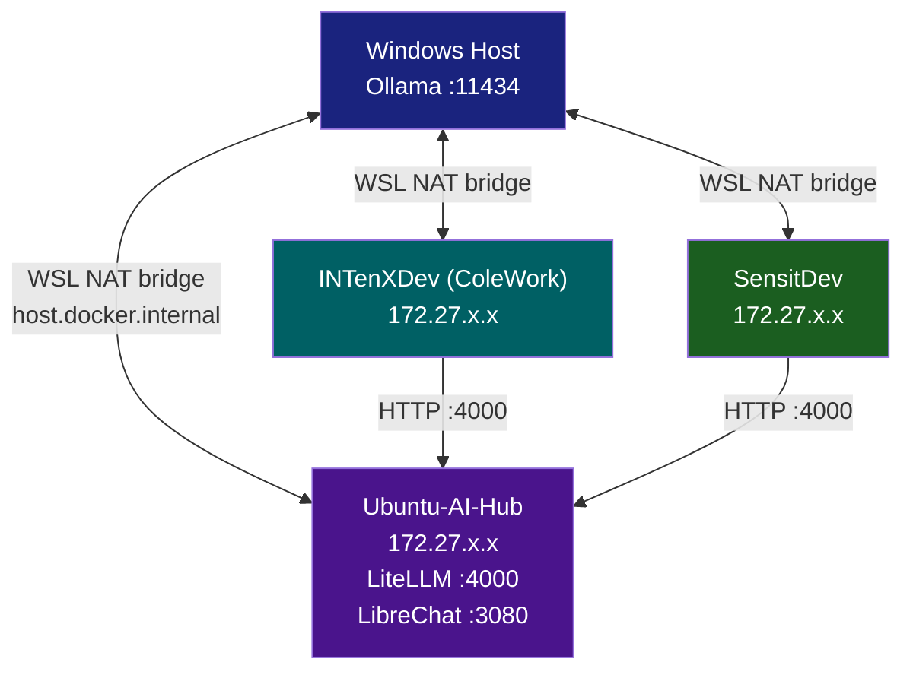

# Architecture Overview

The RTGF AI Stack is a layered infrastructure for AI-first consulting operations across multiple WSL environments, clients, and model backends.

## High-Level Architecture

## Layer Definitions

### Layer 1 — Model Backends
Raw compute: Ollama (local GPU), Anthropic, OpenAI. No application code talks directly to these.

### Layer 2 — Gateway (LiteLLM)
Single OpenAI-compatible endpoint at `:4000`. Handles:

- Virtual key authentication (per client/team)
- Budget enforcement (monthly spend limits)
- Model routing by alias (`local-general` → `llama3.1:8b`)
- Cloud fallback when Ollama unavailable

### Layer 3 — Interface Layer
Multiple clients, all routing through the gateway:

- **Claude Code** — primary development agent
- **Telegram Bot** — mobile/async interface with conversation history
- **LibreChat** — web UI for Ollama (kept, decoupled from RAG)

### Layer 4 — Knowledge Layer
Session archival and retrieval:

- **CHRONICLE** — imports Claude Code sessions to GitHub knowledge repos (YAML canonical format)
- **ctx-search** — searches knowledge repos, injects relevant context into LLM calls
- **Knowledge repos** — one per client, hosted on GitHub INTenX org

### Layer 5 — Security (WARD)
Every Claude Code tool call passes through hooks:

- Pre-tool-use: check against block policies, log intent
- Post-tool-use: log outcome, send Telegram alerts for CRIT events

## WSL Network Topology

!!! note "WSL2 IP Instability"
    WSL2 subnet IPs change on Windows reboot. The Telegram bot has self-healing gateway discovery — it scans WSL subnets for port 4000 if the configured IP is unreachable.
