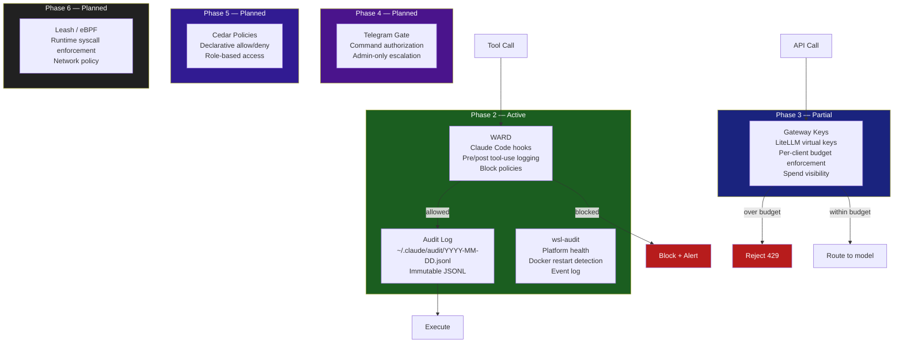
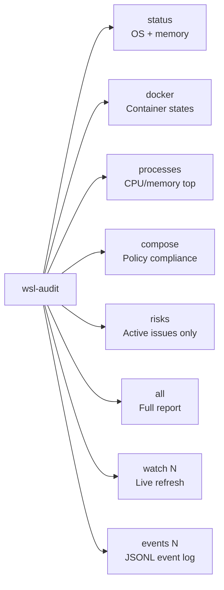
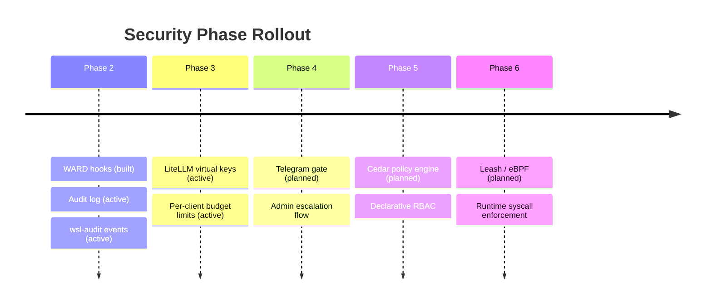

# Security Layers

Defense-in-depth security across all AI operations. Each layer is independently deployable and progressively more restrictive.

## Security Architecture



## WARD — Block Policies

Current blocked patterns in `hooks/policy/blocked-patterns.json`:

| Pattern | Severity | Action |
|---------|----------|--------|
| `rm -rf` | CRITICAL | Block |
| `git reset --hard` | CRITICAL | Block |
| `git push --force` (to main/master) | CRITICAL | Block |
| `DROP TABLE` / `DROP DATABASE` | CRITICAL | Block |
| SSH private key operations | CRITICAL | Block |
| Private key file access (`.pem`, `.key`) | HIGH | Warn |
| Environment file writes (`.env`) | HIGH | Warn |

## Audit Log Format

Every tool call generates a JSONL entry:

```json
{
  "timestamp": "2026-03-05T14:22:01Z",
  "session_id": "abc123",
  "tool": "Bash",
  "command": "git status",
  "decision": "allow",
  "severity": "info",
  "matched_rule": null
}
```

Log location: `~/.claude/audit/YYYY-MM-DD.jsonl`

## wsl-audit Governance

!!! danger "Mandatory before starting Docker services"
    Run `wsl-audit compose` before starting any new Docker service. Checks for missing restart policies and memory caps.



CRIT events trigger Telegram alerts (configured in `~/.local/share/wsl-audit/alert.env`).

## Phase Rollout


