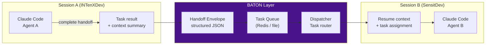
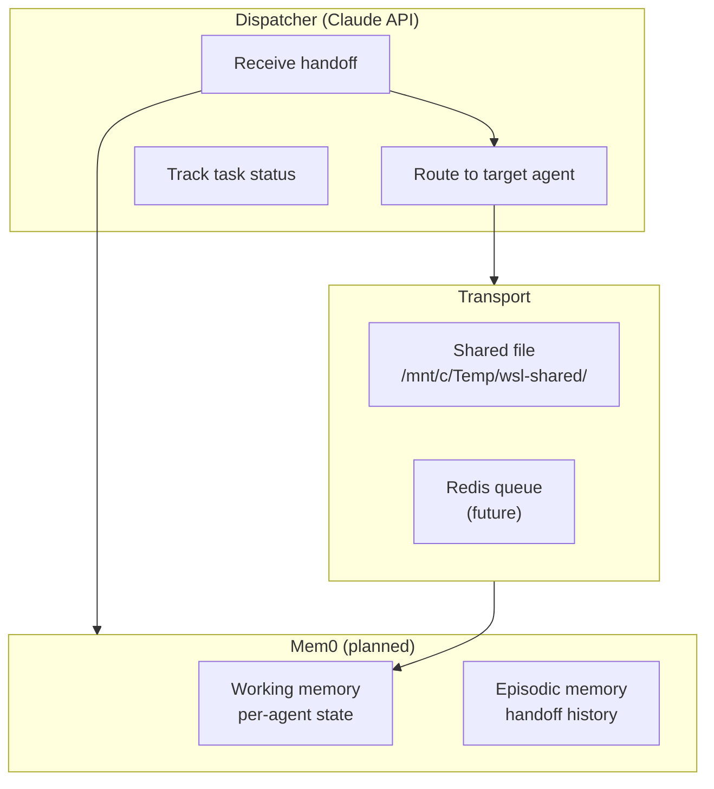

# BATON — Inter-Session Coordination

**Status:** ⬜ Planned
**Location:** `baton/` (scaffolded)

BATON enables AI agents and sessions to hand off context, tasks, and results to each other — across WSL instances, platforms, and time boundaries.

## Concept



## Handoff Envelope Format (Draft)

```json
{
  "baton_version": "1.0",
  "id": "uuid",
  "created_at": "2026-03-05T14:22:01Z",
  "from": {
    "session_id": "abc123",
    "wsl_instance": "INTenXDev",
    "agent": "claude-code"
  },
  "to": {
    "wsl_instance": "SensitDev",
    "agent": "claude-code",
    "routing_hint": "sensit-client-work"
  },
  "task": {
    "type": "implement",
    "title": "Add user auth to Sensit API",
    "description": "...",
    "priority": "high"
  },
  "context": {
    "chronicle_sessions": ["session-id-1", "session-id-2"],
    "working_summary": "...",
    "open_questions": []
  }
}
```

## Planned Architecture



## Integration Points

| Component | BATON Integration |
|-----------|------------------|
| CHRONICLE | Handoffs reference session IDs for context |
| LiteLLM Gateway | Dispatcher routes tasks via API calls |
| Telegram | Admin can trigger/monitor handoffs via bot |
| Mem0 | Replace flat `.chat-history.json` with graph memory |

## Phase 4–5 Roadmap

- **Phase 4:** Design task delegation protocol, build Dispatcher component
- **Phase 5:** BATON transport layer, Mem0 integration, cross-WSL routing
