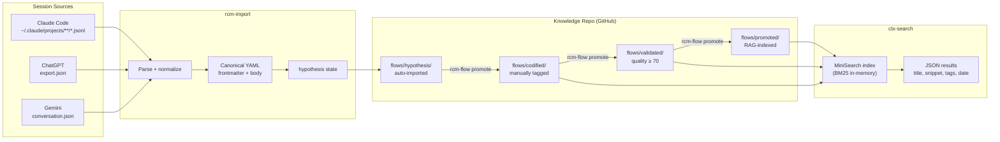

# CHRONICLE — Session Archive and Knowledge Curation

**Status:** ✅ Production
**Location:** `chronicle/`
**Package:** `rtgf-chronicle`

Git-native LLM conversation archival with knowledge flow states, multi-platform adapters, and semantic search.

## How It Works



## Canonical Session Format

Sessions are stored as Markdown files with YAML frontmatter:

```yaml
---
id: "a1b2c3d4-..."
title: "Implement LiteLLM gateway routing"
platform: claude-code
date: "2026-03-05T14:22:01Z"
flow_state: codified
tags: [litellm, gateway, routing, docker]
quality_score: 82
repo: intenx-knowledge
client: intenx
---

## Session Summary
...session content...
```

## CLI Tools

| Command | Description |
|---------|-------------|
| `rcm-import --source <jsonl> --platform claude-code --target <repo>` | Import a session |
| `rcm-export --session <id>` | Export a session |
| `ctx-search "<query>" --format json --recent 5` | Search sessions |
| `rcm-flow promote --session <id> --to codified --tags "topic"` | Advance knowledge flow state |
| `rcm-find-orphans --target <repo> --import` | Find and import missed sessions |

## Daily Import Cron

```bash
# Activate with: crontab -e
0 2 * * * bash ~/rtgf-ai-stack/chronicle/cron-daily-import.sh >> ~/.local/share/chronicle/cron.log 2>&1
```

The cron script scans `~/.claude/projects/` for JSONL files modified in the last 24 hours and imports any new sessions.

## Multi-Platform Adapters

| Platform | Adapter | Status |
|----------|---------|--------|
| Claude Code | Built-in | ✅ Production |
| ChatGPT | `adapters/chatgpt.js` | ✅ Built |
| Gemini | `adapters/gemini.js` | ✅ Built |

## Telegram Integration

The `/chronicle` command in the Telegram bot uses `ctx-search` to search the knowledge archive:

```
/chronicle LiteLLM gateway setup
```

Returns matching session titles, tags, flow state, date, and repo.
