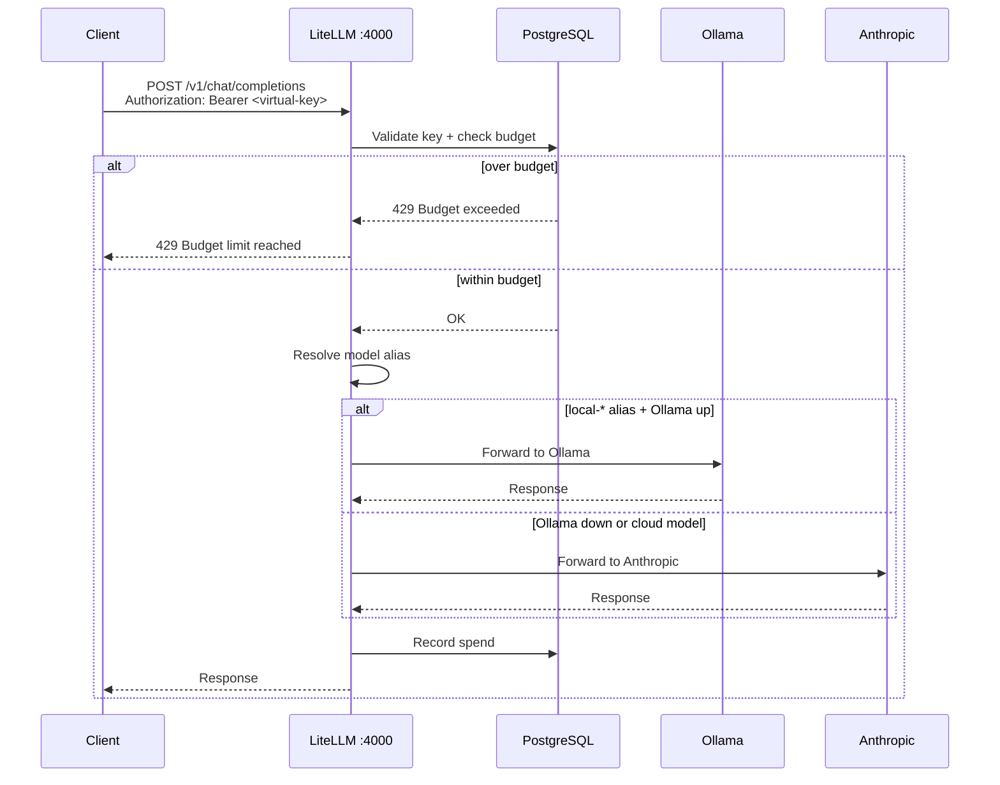

# LiteLLM Gateway

**Status:** ✅ Deployed (AI Hub WSL — gateway host)
**Location:** `gateway/` + `compose/gateway.yml`
**Endpoint:** `http://<hub-ip>:4000/v1`

Single OpenAI-compatible proxy routing all model calls with per-client budget enforcement.

## Request Flow



## Model Aliases

| Alias | Primary Backend | Fallback |
|-------|----------------|---------|
| `local-general` | `ollama/llama3.1:8b` | `claude-haiku-4-5` |
| `local-coding` | `ollama/qwen2.5-coder:14b` | `claude-sonnet-4-6` |
| `local-reason` | `ollama/deepseek-r1:14b` | `claude-sonnet-4-6` |
| `local-fast` | `ollama/llama3.2:3b` | `claude-haiku-4-5` |
| `local-compact` | `ollama/phi4-mini` | `claude-haiku-4-5` |
| `local-coding-fast` | `ollama/deepseek-coder-v2:lite` | `claude-sonnet-4-6` |

## Client Key Setup

```bash
# Create a virtual key with monthly budget
bash gateway/setup-client.sh <client-name> <monthly-budget-usd>

# Example
bash gateway/setup-client.sh intenx 200
bash gateway/setup-client.sh sensit 50
```

Keys are stored in `gateway/client-keys/` (gitignored).

## Deployment

```yaml
# compose/gateway.yml (key services)
services:
  litellm:
    image: ghcr.io/berriai/litellm:main-latest
    ports: ["4000:4000"]
    environment:
      DATABASE_URL: postgresql://litellm:litellm@db:5432/litellm
      LITELLM_MASTER_KEY: ${LITELLM_MASTER_KEY}
    depends_on: [db]
    restart: unless-stopped

  db:
    image: postgres:15
    volumes: [litellm-db:/var/lib/postgresql/data]
    restart: unless-stopped
```

## Configuration

`gateway/config.yaml` defines model routing:

```yaml
model_list:
  - model_name: local-general
    litellm_params:
      model: ollama/llama3.1:8b
      api_base: http://host.docker.internal:11434

general_settings:
  store_model_in_db: true
  database_url: "os.environ/DATABASE_URL"
```

## Dashboard

LiteLLM UI at `http://<hub-ip>:4000/ui` — shows spend by team, model usage, key management.
