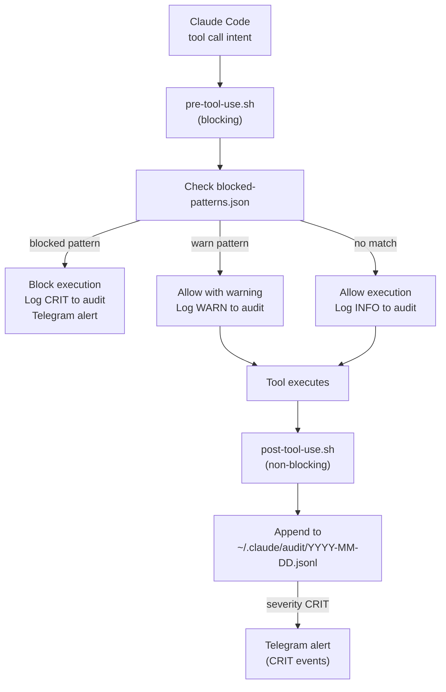

# WARD — Claude Code Security Hooks

**Status:** ✅ Built (run `install-hooks.sh` to activate)
**Location:** `hooks/`
**Formerly:** SENTINEL

Every Claude Code tool call passes through WARD hooks. Pre-tool-use blocks dangerous operations; post-tool-use logs outcomes and sends Telegram alerts for critical events.

## Hook Execution Flow



## Installation

```bash
bash ~/rtgf-ai-stack/hooks/install-hooks.sh
```

This copies hooks to `~/.claude/hooks/` and creates the `ward.env` config file.

## Configuration

```bash
# ~/.claude/hooks/ward.env
TELEGRAM_TOKEN=<your-bot-token>
TELEGRAM_CHAT_ID=<your-admin-chat-id>
AUDIT_LOG_DIR=~/.claude/audit
```

## Block Policy Format

`hooks/policy/blocked-patterns.json`:

```json
{
  "rules": [
    {
      "id": "no-rm-rf",
      "pattern": "rm\\s+-rf",
      "severity": "CRITICAL",
      "action": "block",
      "message": "Destructive rm -rf blocked"
    },
    {
      "id": "no-force-push-main",
      "pattern": "git push.*--force.*(?:main|master)",
      "severity": "CRITICAL",
      "action": "block",
      "message": "Force push to main/master blocked"
    },
    {
      "id": "no-hard-reset",
      "pattern": "git reset.*--hard",
      "severity": "CRITICAL",
      "action": "block",
      "message": "Hard reset blocked"
    }
  ]
}
```

## Audit Log

Each event appended to `~/.claude/audit/YYYY-MM-DD.jsonl`:

```json
{
  "timestamp": "2026-03-05T14:22:01.000Z",
  "session_id": "abc123def456",
  "tool": "Bash",
  "input": {"command": "git status"},
  "decision": "allow",
  "severity": "info",
  "matched_rule": null,
  "duration_ms": 145
}
```

## SOC 2 Relevance

The immutable JSONL audit trail is a foundation for SOC 2 evidence:

| SOC 2 Control | WARD Artifact |
|--------------|---------------|
| CC6.1 — Logical access | Virtual keys + block policies |
| CC6.8 — Unauthorized software | Block policies for destructive ops |
| CC7.1 — Detection & monitoring | JSONL audit log |
| CC7.2 — Evaluation of security events | Telegram CRIT alerts |
