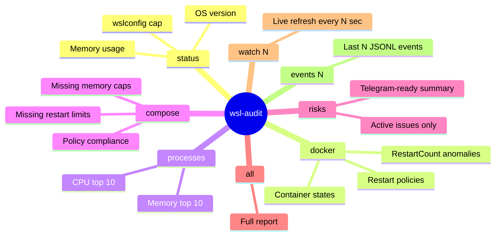

# wsl-audit

**Status:** ✅ Built + Phase 2 enhanced
**Location:** `~/.local/bin/wsl-audit` (symlinked from `scripts/wsl-audit`)

Platform health monitoring for WSL2/Docker environments. Detects runaway containers, memory pressure, restart storms, and missing governance artifacts.

## Subcommands



## Governance Requirements

!!! danger "Mandatory before any Docker service"
    1. `.wslconfig` must have memory cap (`memory=8GB` max)
    2. No `restart: always` — use `restart: unless-stopped`
    3. Run `wsl-audit compose` before `docker compose up`

## Event Log

Phase 2 added structured JSONL event logging:

```
~/.local/share/wsl-audit/events/YYYY-MM-DD.jsonl
```

Format:
```json
{
  "timestamp": "2026-03-05T14:22:01Z",
  "severity": "CRIT",
  "check": "docker_restart_storm",
  "message": "Container litellm restarted 15 times in last hour",
  "data": {"container": "litellm", "restarts": 15}
}
```

## Telegram Alerts

CRIT events send Telegram messages with cooldown to prevent flood:

```bash
# Configure alerts
cat ~/.local/share/wsl-audit/alert.env
TELEGRAM_TOKEN=<bot-token>
TELEGRAM_CHAT_ID=<admin-chat-id>
ALERT_COOLDOWN_MINUTES=30
```

## Telegram Bot Integration

`/status` and `/health` commands run wsl-audit remotely:

| Command | wsl-audit mode | Use case |
|---------|---------------|----------|
| `/status` | `risks` | Quick health check |
| `/health` | `all` | Full audit report |

Scheduled jobs can run wsl-audit on a cron via the bot config:

```yaml
# interface/config.yaml
scheduled:
  - name: daily-health
    cron: "0 8 * * *"
    command: wsl-audit
    args: [risks]
    chat_id: default
    label: "Daily Health Check"
```
