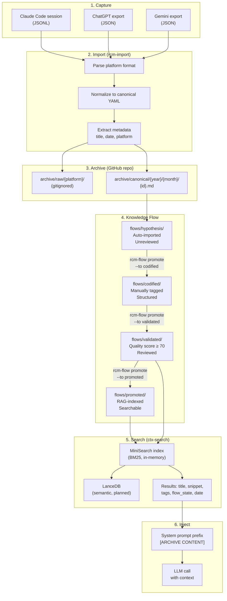
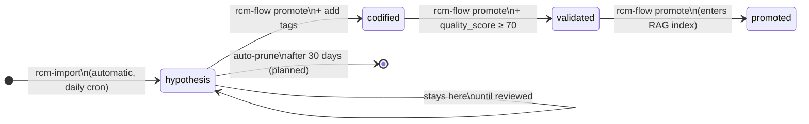

# Knowledge Flow

How sessions move from raw conversation to searchable knowledge.

## Full Pipeline



## Quality Scoring

Sessions earn a quality score (0–100) during curation:

| Score Range | Meaning | Auto-promote? |
|-------------|---------|---------------|
| 0–49 | Low — raw capture | No |
| 50–69 | Medium — tagged but unverified | No |
| 70–84 | Good — reviewed, accurate | Yes → validated |
| 85–100 | Excellent — canonical reference | Yes → promoted |

## rcm-flow Commands

```bash
# Promote a session forward
node ~/rtgf-ai-stack/chronicle/tools/cli/rcm-flow.js \
  promote \
  --session <session-id> \
  --to codified \
  --tags "litellm, gateway, docker"

# Set quality score
node ~/rtgf-ai-stack/chronicle/tools/cli/rcm-flow.js \
  score \
  --session <session-id> \
  --score 82

# List sessions in a flow state
node ~/rtgf-ai-stack/chronicle/tools/cli/rcm-flow.js \
  list \
  --state hypothesis \
  --repo ~/intenx-knowledge
```

## State Transitions



## Finding Orphaned Sessions

Sessions can be missed by the daily cron (e.g., if the machine was off):

```bash
node ~/rtgf-ai-stack/chronicle/tools/cli/rcm-find-orphans.js \
  --target ~/intenx-knowledge \
  --import
```

This scans `~/.claude/projects/` for JSONL sessions not yet in the knowledge repo and imports them.
