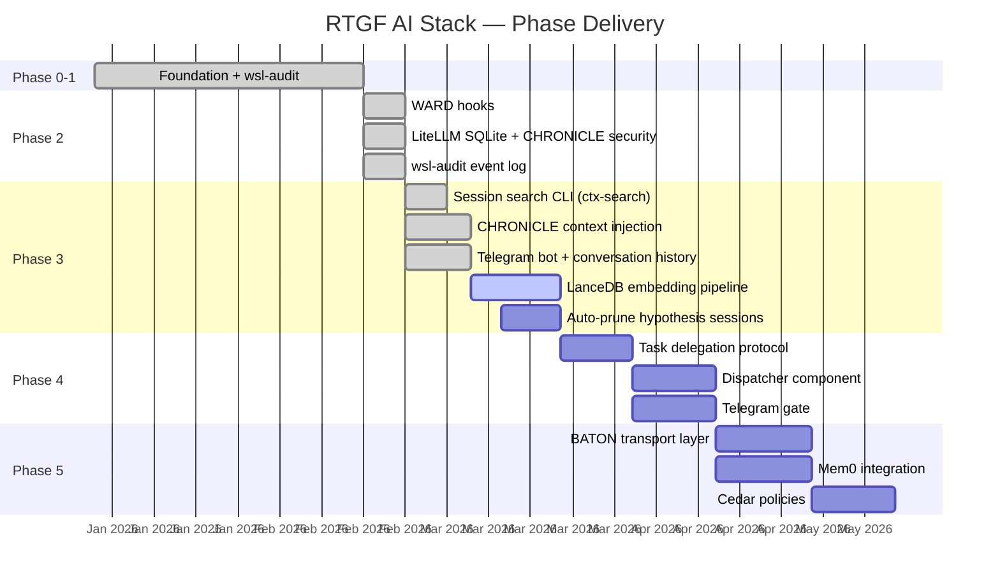

# Roadmap

## Phase Status

## Detailed Phase Breakdown

### ✅ Phase 0–1: Foundation
- Ollama running on Windows AMD GPU
- wsl-audit platform health tool
- CHRONICLE session archival (100+ sessions)
- Knowledge repos deployed (7 repos)
- LibreChat web UI

### ✅ Phase 2: Security Foundation
- WARD Claude Code hooks (`hooks/`)
- LiteLLM gateway deployed on Ubuntu-AI-Hub
- PostgreSQL backend for spend tracking
- wsl-audit event log + Telegram CRIT alerts
- CHRONICLE security fields (flow_state, quality_score)

### ✅ Phase 3 (Partial): Context + Interface
- [x] ctx-search CLI (MiniSearch BM25)
- [x] Telegram bot with conversation history
- [x] CHRONICLE context injection in bot
- [x] systemd service for bot
- [x] Self-healing gateway discovery
- [ ] LanceDB semantic search pipeline
- [ ] Auto-prune hypothesis sessions >30 days
- [ ] ChatGPT/Gemini CHRONICLE adapters (built, needs import run)

### ⬜ Phase 4: Coordination
- [ ] Task delegation protocol design
- [ ] Dispatcher component (`dispatcher/`)
- [ ] Telegram gate (command authorization)
- [ ] Mem0 memory orchestration

### ⬜ Phase 5: BATON
- [ ] Inter-session handoff transport
- [ ] Cross-WSL routing
- [ ] Cedar policy engine
- [ ] Leash/eBPF runtime enforcement

## Priority Items (Now)

| Priority | Task | Why |
|----------|------|-----|
| P0 | `loginctl enable-linger cbasta` | Bot dies on logout |
| P0 | Create LiteLLM keys for intenx/sensit teams | Client isolation |
| P1 | `ctx/archive/raw/` to .gitignore in knowledge repos | Git growth |
| P1 | LanceDB embedding pipeline | Semantic search |
| P2 | Auto-prune hypothesis sessions | Git size |
| P2 | Khoj PoC evaluation | Markdown-native RAG |
