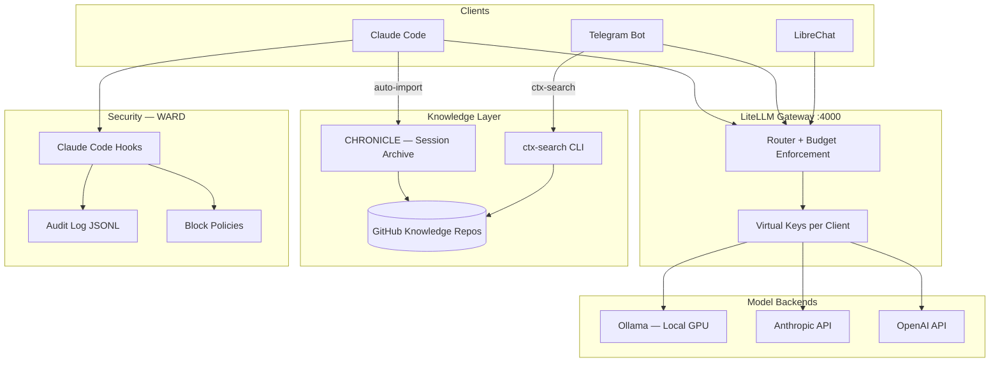

# RTGF AI Stack

**INTenX AI Development Stack** — unified model routing, session archival, security enforcement, and inter-session coordination for AI-first consulting operations.

---

## Choose your documentation

| I want to... | Go to... |
|--------------|----------|
| Understand how the stack fits together | [Architecture Overview](architecture/overview.md) |
| See the memory and knowledge model | [Memory Model](architecture/memory-model.md) |
| Understand security enforcement | [Security Layers](architecture/security-layers.md) |
| Learn about a specific component | [Components](components/chronicle.md) |
| Get something running | [Quick Start](operations/quick-start.md) |
| See what's built and what's next | [Roadmap](development/roadmap.md) |

---

## Stack at a Glance

---

## Component Status

| Component | Status | Location |
|-----------|--------|----------|
| **Ollama** (local models) | ✅ Operational | Windows/AMD, all WSL |
| **CHRONICLE** (session archival) | ✅ Production | `chronicle/` |
| **LiteLLM Gateway** | ✅ Deployed | AI Hub WSL `:4000` |
| **Telegram Interface** | ✅ Running | `interface/` → systemd |
| **WARD** (Claude Code hooks) | ✅ Built | `hooks/` |
| **wsl-audit** | ✅ Built | `~/.local/bin/wsl-audit` |
| **LibreChat** | ✅ Keep + decouple | AI Hub WSL `:3080` |
| **BATON** (inter-session) | ⬜ Planned | `baton/` |

---

## Quick Facts

- **Repo:** `github.com/INTenX/rtgf-ai-stack`
- **WSL layout:** Dev WSL (primary dev + bot) + AI Hub WSL (gateway host)
- **Gateway:** `http://10.5.0.2:4000` (auto-discovered)
- **Ollama:** Windows AMD RX 7600S, accessible from all WSL
- **Knowledge repos:** 7 deployed (intenx, sensit, makanui, ratio11, beaglebone, test + tools)
