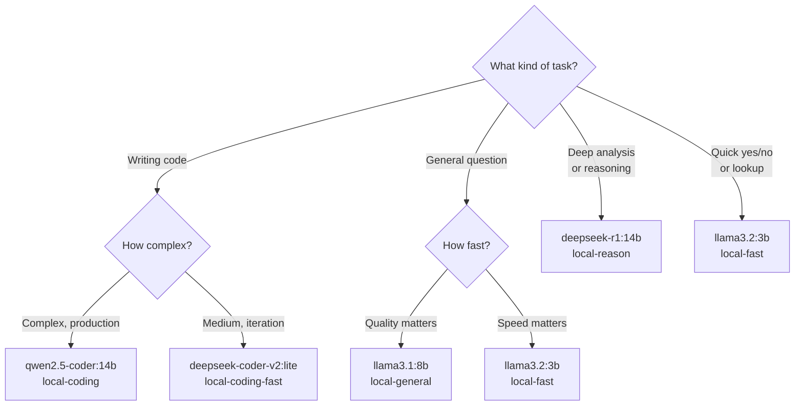

# Model Reference

## Installed Models (Ollama)

| Model | Size | Best For | Alias |
|-------|------|----------|-------|
| `qwen2.5-coder:14b` | 9.0 GB | Coding — best quality | `local-coding` |
| `deepseek-coder-v2:lite` | 8.9 GB | Coding — MoE architecture | `local-coding-fast` |
| `deepseek-r1:14b` | ~9 GB | Reasoning — chain of thought | `local-reason` |
| `llama3.1:8b` | 4.9 GB | General reasoning | `local-general` |
| `qwen2.5-coder:7b` | 4.7 GB | Coding — fast | — |
| `mistral:7b` | 4.4 GB | General purpose | — |
| `phi4-mini` | 2.5 GB | Compact, capable | `local-compact` |
| `llama3.2:3b` | 2.0 GB | Fast chat | `local-fast` |
| `gemma2:2b` | 1.6 GB | Ultra-fast, simple | — |

## Model Selection Guide



## Telegram Command → Model Mapping

| Command | Alias | Backend | Use When |
|---------|-------|---------|----------|
| `/ask` | `local-general` | llama3.1:8b | Default questions |
| `/code` | `local-coding` | qwen2.5-coder:14b | Code review, debugging |
| `/reason` | `local-reason` | deepseek-r1:14b | Architecture, analysis |
| `/fast` | `local-fast` | llama3.2:3b | Quick lookups, status |

## Cloud Fallbacks

When Ollama is unavailable or for cloud-only tasks:

| Alias | Cloud Fallback |
|-------|---------------|
| `local-general` | `claude-haiku-4-5` |
| `local-coding` | `claude-sonnet-4-6` |
| `local-reason` | `claude-sonnet-4-6` |
| `local-fast` | `claude-haiku-4-5` |

## Pulling New Models

Via Telegram (admin only):
```
/pull <model-name>
```

Via CLI (from any WSL with Ollama access):
```bash
source /mnt/c/Temp/wsl-shared/ollama-setup.sh
ollama pull <model-name>
```

GPU memory budget (AMD RX 7600S = 8GB VRAM):

- Max single model: ~9GB (fits with system memory offload)
- Two models simultaneously: only if both ≤ 4GB
- For coding + reasoning together: pull one, use, pull other
