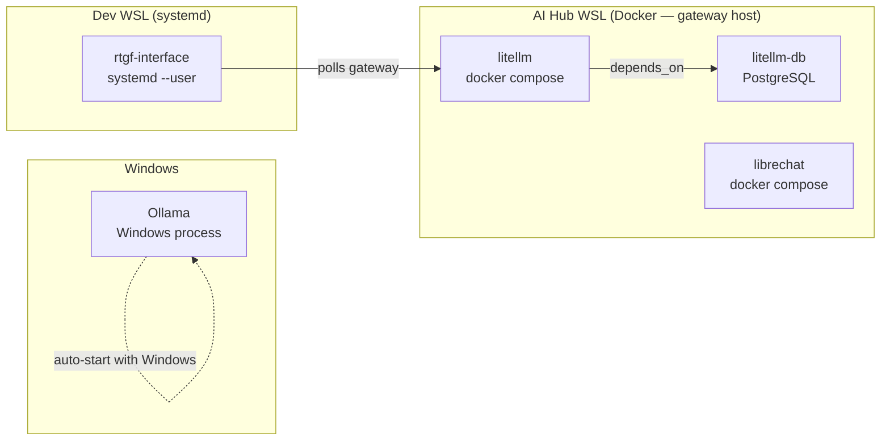

# Service Management

## Service Overview



## Telegram Bot (Dev WSL)

```bash
# Status
systemctl --user status rtgf-interface

# Logs (live)
journalctl --user -u rtgf-interface -f

# Restart
systemctl --user restart rtgf-interface

# Stop
systemctl --user stop rtgf-interface
```

## LiteLLM Gateway (AI Hub WSL)

```bash
cd ~/rtgf-ai-stack

# Start
docker compose -f compose/gateway.yml up -d

# Stop
docker compose -f compose/gateway.yml down

# Restart (preserve DB)
docker compose -f compose/gateway.yml restart litellm

# Full reset (drops DB — lose all keys/spend data)
docker compose -f compose/gateway.yml down -v

# Logs
docker compose -f compose/gateway.yml logs -f litellm
```

## LibreChat (AI Hub WSL)

```bash
cd ~/LibreChat
docker compose up -d
docker compose logs -f librechat
```

## CHRONICLE Daily Import

```bash
# Check if cron is set up
crontab -l | grep chronicle

# Add if missing
crontab -e
# Add: 0 2 * * * bash ~/rtgf-ai-stack/chronicle/cron-daily-import.sh >> ~/.local/share/chronicle/cron.log 2>&1

# Run manually
bash ~/rtgf-ai-stack/chronicle/cron-daily-import.sh
```

## Ollama (Windows)

```powershell
# Start Ollama server (PowerShell)
& "$env:LOCALAPPDATA\Programs\Ollama\ollama.exe" serve

# List models
ollama list

# Pull a model
ollama pull qwen2.5-coder:14b
```

From WSL (after running ollama-setup.sh):
```bash
ollama list
ollama pull llama3.1:8b
```

## Health Checks

| Service | Health Check |
|---------|-------------|
| Ollama | `curl http://$(ip route show default \| awk '{print $3}'):11434/api/tags` |
| LiteLLM | `curl http://localhost:4000/health` |
| LiteLLM models | `curl http://localhost:4000/v1/models -H "Authorization: Bearer $MASTER_KEY"` |
| Telegram bot | Send `/whoami` in Telegram |
